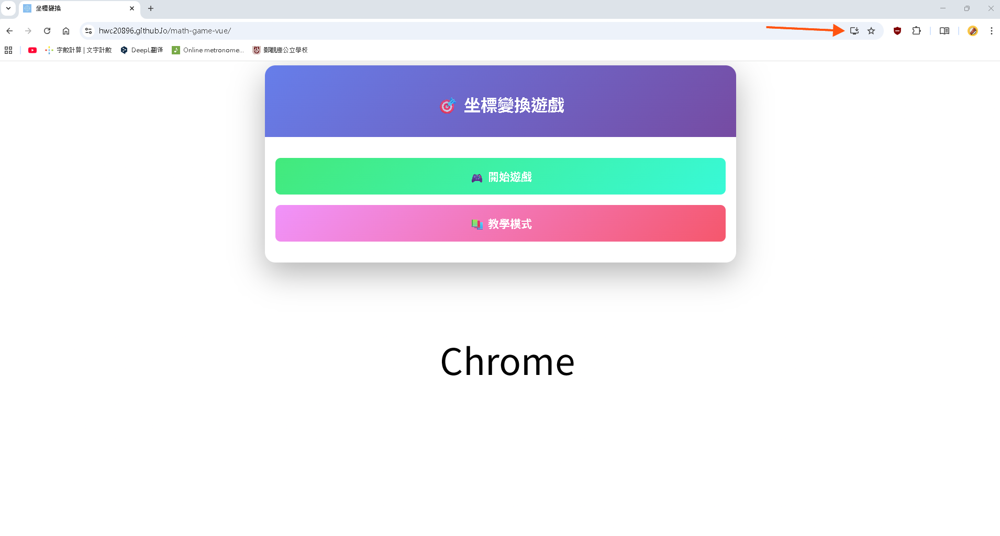
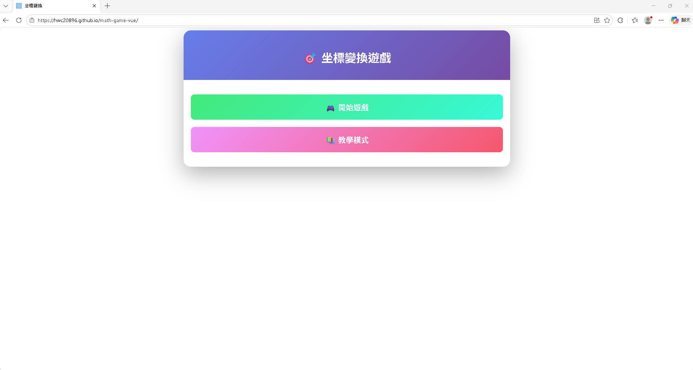
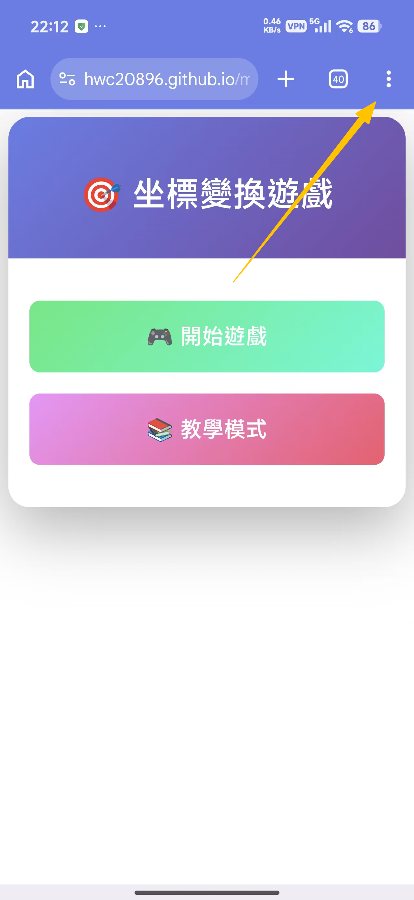
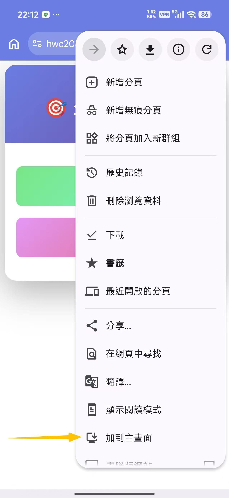
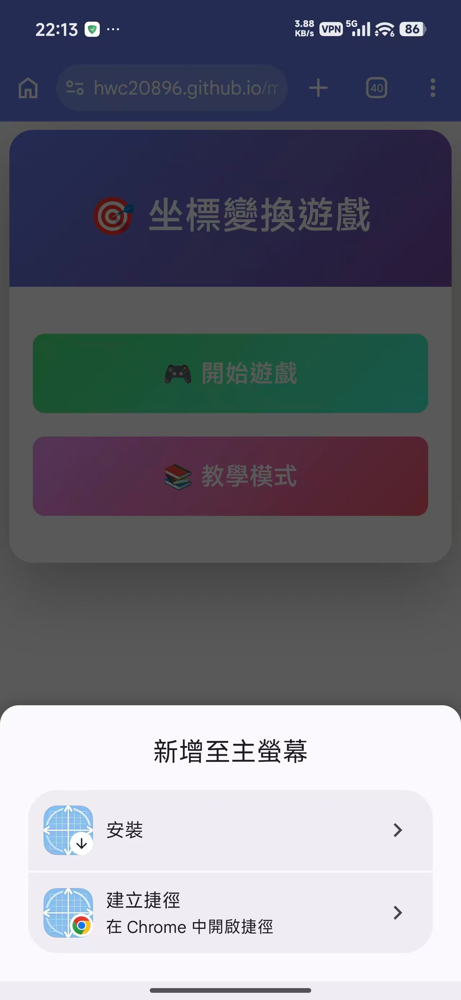
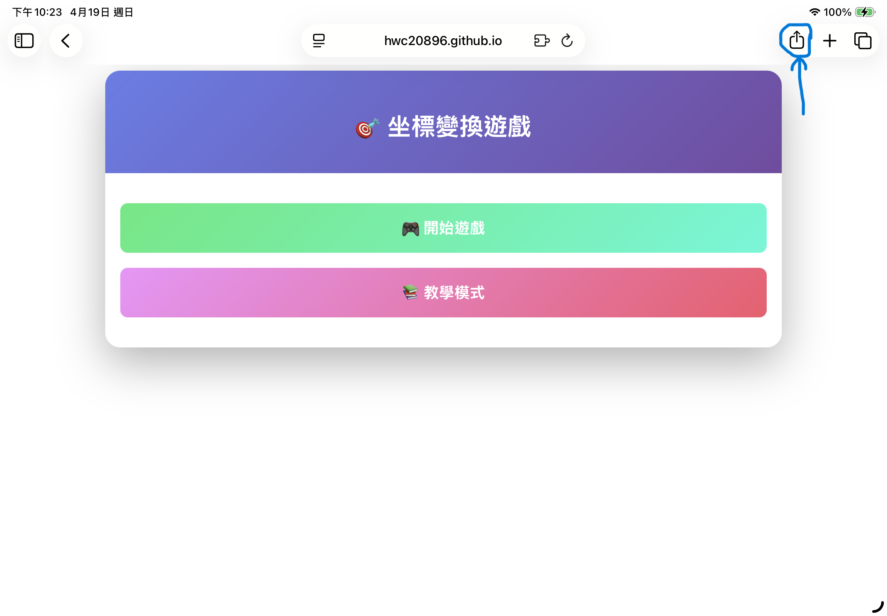
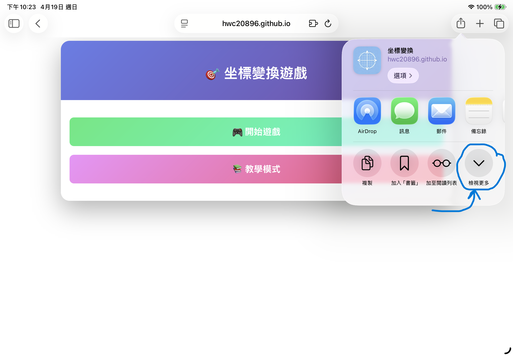
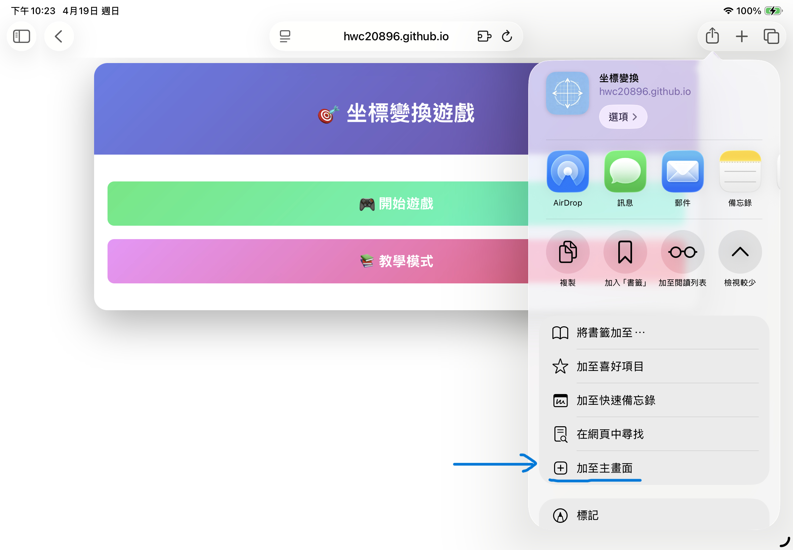
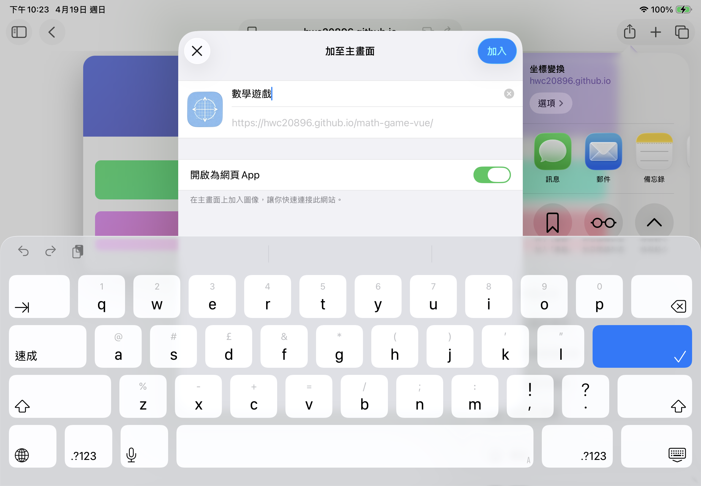

# PWA 應用安裝教程

## 桌面端安裝

1. 點擊網頁右上角的「新增至主畫面」按鈕（Chrome、Firefox、Edge），按指示增加即可

----

## 移動端安裝（Android）

1. 打開瀏覽器（通常為Chrome），打開網頁並按右上角三顆點

2. 選擇「加到主頁面」

3. 按需選擇即可

----

## 移動端安裝（iOS、iPadOS）

1. 打開瀏覽器（通常為Chrome），打開網頁並按右上角分享

2. 點擊「檢視更多」

3. 選擇「加至主畫面」

4. 按指示增加即可

