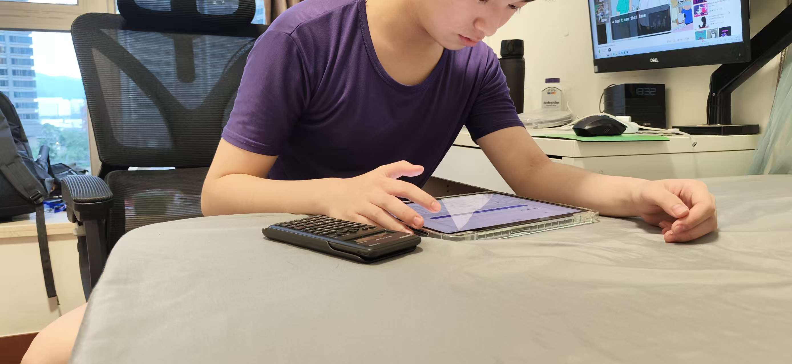
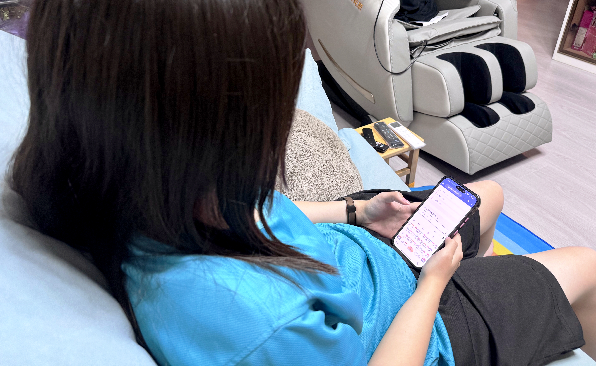
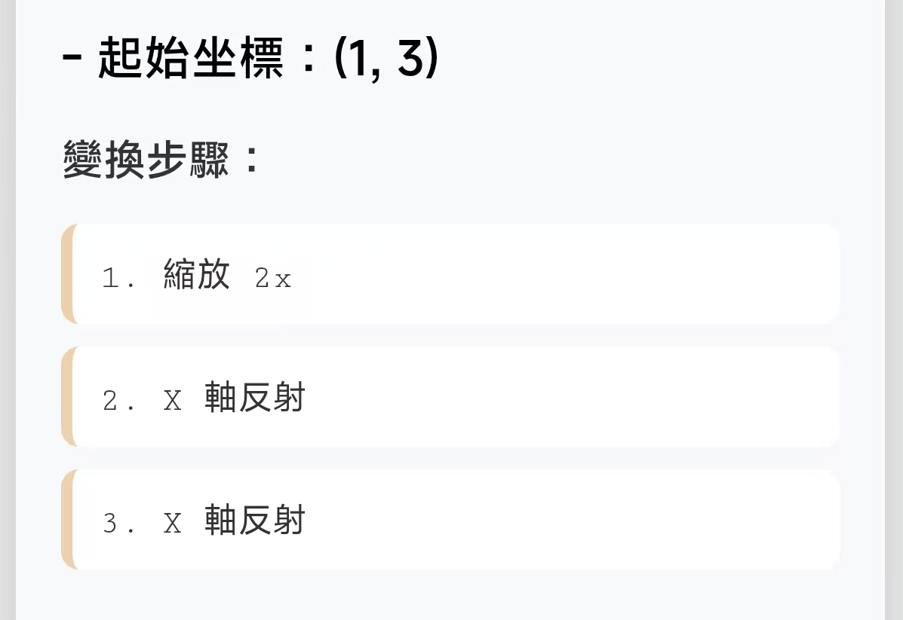
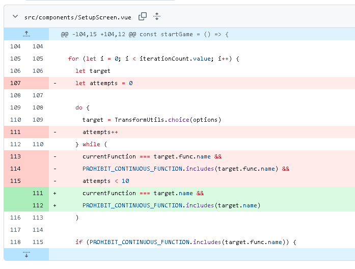

# 坐標變換遊戲

## 0. 關於專案

### 儲存庫 URL：

https://github.com/hwc20896/math-game-vue

### 成品 URL：
https://hwc20896.github.io/math-game-vue/

> [!NOTE]  
> 此專案為PWA專案，意味著此專案可以通過網路下載並安裝到設備（Windows、iOS、Android等）上。

## 1. 基本信息

### 組別：
__A-02__

### 組員：
- SC3A 03 洪偉晴
- SC3A 05 古藝軒
- SC3A 10 吳恩羚

----

## 2. 怎麽玩

### 遊戲模式

遊戲提供兩種主要模式：**挑戰模式**和**教學模式**。

#### 🎮 挑戰模式

1. **選擇難度**
    - **基礎 (Basic)** 🟢：適合初學者，數字較小，可使用心算
    - **進階 (Advanced)** 🟡：中等難度，需要計算機輔助
    - **困難 (Difficult)** 🟠：複雜變換，考驗空間想像力
    - **地獄 (Hell)** 🔴：極限挑戰，綜合所有變換類型

2. **選擇變換類型**
    - 平移、縮放、旋轉、反射等
    - 可勾選多個類型混合出題

3. **設定題目數量**
    - 選擇要挑戰的題目數（2-10 題）

4. **開始作答**
    - 系統會顯示原始坐標和變換規則
    - 輸入變換後的坐標 `(x, y)`
    - 即時反饋對錯

#### 📚 教學模式

1. **選擇課程**
    - 共 10 個課程，涵蓋所有變換類型
    - 每個課程標註適用難度等級

2. **學習內容**
    - **📖 這是什麼？**：概念說明
    - **📊 視覺演示**：動畫展示變換過程
        - 播放動畫觀看點的移動軌跡
        - 紅色虛線標示反射軸或旋轉中心
        - 弧線箭頭顯示旋轉方向和角度
    - **🧮 如何計算**：公式和逐步解題示範
        - 使用 KaTeX 渲染數學公式
        - LaTeX 格式的步驟說明
    - **✏️ 練習題**：隨機生成練習題
        - 可點擊「🔄 換一題」刷新題目
        - 輸入答案並檢查

3. **課程列表**
    - **基礎課程**：
        - 平移 (Translation) ↔️
        - 縮放 (Scaling) 📏
        - 旋轉 - 特殊角 🔄（90°、180°、-90°，可心算）
        - X 軸反射 🪞
        - Y 軸反射 🪞

    - **進階課程**：
        - 旋轉 - 一般角 🧮（30°、45°、60°等，需計算機）
        - 繞點旋轉 🎯
        - y=x 直線反射 📐
        - y=-x 直線反射 📐

    - **專家課程**：
        - 一般直線反射 ✏️（Ax+By+C=0）

### 操作說明

#### 輸入格式
- 坐標必須使用括號格式：`(x, y)`
- 例如：`(3, -5)`、`(-2, 4)`
- 支援小數輸入（如旋轉一般角時）

#### 難度標籤說明
在教學頁面中，每個課程會顯示適用的難度等級：
- 🔵 **1** = 基礎
- 🟡 **2** = 進階
- 🟠 **3** = 困難
- ⚫ **4** = 地獄

例如「旋轉 - 特殊角」顯示 `1 2 3 4`，表示這個知識點在所有難度都會出現。

### 遊戲特色

✅ **即時反饋**：答題後立即知道對錯  
✅ **視覺化教學**：動畫演示讓抽象概念具體化  
✅ **漸進式難度**：從簡單到複雜，循序漸進  
✅ **無限練習**：教學模式的練習題可無限刷新  
✅ **離線可用**：PWA 技術支援離線學習  
✅ **跨平台**：支援 Windows、iOS、Android 等設備

### 小技巧

💡 **基礎難度**：專注練習特殊角旋轉（±90°、180°），記住特殊角旋轉口訣：
- **90° / -90°**：**交換** x, y，再看象限定正負。
- **180°**：**不交換** x, y，兩個都變號。

💡 **進階以上**：善用計算機計算三角函數值，注意保留足夠的小數位數

💡 **教學模式**：先觀看動畫演示，理解變換原理後再做練習題

----

## 3. 設計理念

### 選擇這個主題的原因

首先坐標是數學裡特別基礎又實用的知識，不管是平時做作業、考試，還是後續學更難的幾何內容，都離不開它，是必須掌握的重點，但很多同學覺得它抽象難懂，學起來很無趣。

而且坐標轉換很適合做成網頁互動遊戲，能透過畫面直接展示點的位置變化，操作起來簡單直覺，不用複雜的步驟。再加上生活裡地圖定位、遊戲角色移動都會用到坐標，選這個主題，能讓大家發現數學不是隻在課本裡，而是和生活息息相關，學起來更有動力。

### 爲什麽這個游戲會好玩

比起趴在紙上算題，這個遊戲有即時的反饋，操作完馬上就能看到坐標轉換後的結果，對錯一眼就能知道，不會有算半天不知道結果的煩惱。

遊戲可以慢慢提升難度，從簡單的平移，到稍微複雜的旋轉、對稱，一步步挑戰，過關的時候會特別有成就感，不會一上來就被難倒失去興趣。

而且全程是動手操作的互動模式，不是被動看知識、做題目，全程專注在「找位置、闖關」的過程裡，不知不覺就學會了知識，完全不會覺得數學枯燥乏味，同學之間還能互相挑戰，玩起來更有樂趣。

----

## 4. 數學原理

請參看[math_functions.md](math_functions.md)。

----

## 5. 試玩情況記錄

### a) 游玩圖片

### b) （其中兩個）反饋

有測試人員測試游玩進階難度，發現題目給出了連續兩次X軸反射的變換（即抵消），導致題目難度大幅減少。

針對此事，開發人員針對此類反射變換進行了兩次修改，確保該反射變換不會連續出現兩次。

另外有測試人員在測試地獄難度時，運氣好抽到了個含「縮放 0 倍」的題目，直接從地獄直上天堂。

針對此事，開發人員對縮放變換進行了修改，確保縮放變換的倍率不能等於 -1、0 或 1（額外的兩個都有可能會導致題目變簡單，在這裏一并處理）。

----

## 6. PWA專場：如何安裝

請看[INSTALL.md](INSTALL.md)。

## 7. 分工表

|  組員   |  學號  | 負責項目                 |
|:-----:|:----:|:---------------------|
|  洪偉晴  |  3   | 游戲開發、除錯（GitHub賬號擁有者） |
|  古藝軒  |  5   | 前端設計、測試              |
|  吳恩羚  |  10  | Logo、測試              |

## 8. 補充：如何在本地運行

請參考[BUILD.md](BUILD.md)。注意該文件以全英文書寫。
